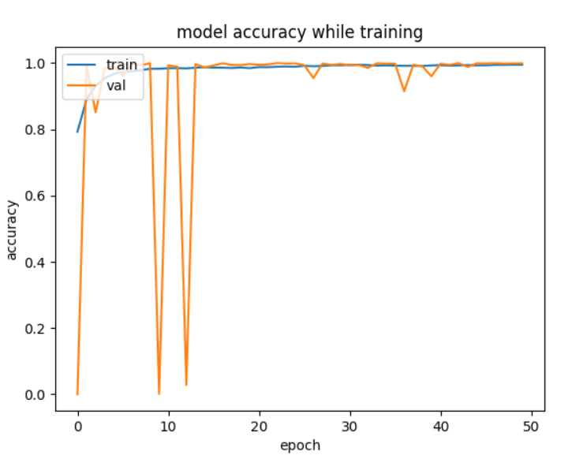
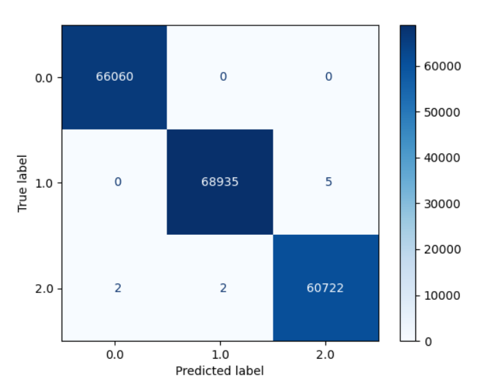
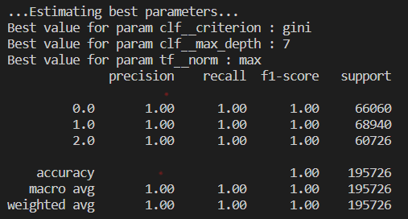

# TP3 : machine learning
Ce TP de machine learning 

## Expliquer l’approche pour l’extraction de caractéristiques
Les charactéristiques sont sous forme de dataframe pandas. Il s'agit d'une composition de plusieurs timeseries
* Chaque timeserie contient des captures d'accéléromètres (une ligne = x,y,z) prises à intervalles réguliers
* Les timeseries sont séparées par label (balanced, unbalanced, eletrictal_failure)
* Les timeseries sont séparées par la vitesse du robot, de 75 a 100 par pas de 5


### Feature extraites
L'idée est de ne pas feed les accélérations telles quelles aux intelligences artificielles créées, mais plutôt à leur apporter des données extraites des timeseries.
L'extraction exhaustive a été tentée :
``` settings = MinimalFCParameters()```\
```extract_features(timeseries, default_fc_parameters=settings, column_id="id")```\
```print(extracted_features)```\
Mais celle-ci est bien trop longue. Une extraction à la main a donc été entreprie.\
D'abord, avec une normalisation à la min des trois données a1, a2 et a3 en norm_a1, norm_a2 et norm_a3. Malheureusement, cette normalisation à la main ne fonctionnait pas très bien.\
Les charactéristiques sorties sont :\
* max
* min
* std
* mean

Et tous ces composants sont effectés en rolling window de 500. En effet, les dataframes comportent des données dans l'ordre de grandeur des dizaines de millier, un rolling_window dans les centaines ne parrait pas excessif.\
La speed est également retenue car on peut imaginer que le robot réagit différement selon sa vitesse - le modèle prendra donc en compte la vitesse du robot pour les prédicats lorsqu'il sera entrainé.

## Neural Network
Le neural network est effectué en groupe

### Train, test, validation
Le neural network possède deux séparations des données.\
Lors du fit, la méthode validation_split est mis à 0.2, ce qui fait que les x_train et y_train sont séparés en 80:20 :\
``` history = model.fit(x_train, y_train, batch_size=100, epochs=50, validation_split=0.2) ```\
Ce set de training a déja été séparé d'un set de validation plus tôt lors du parcours des datagrammes : \
```train, test = train_test_split(timeserie, test_size=proportionTest)```\
Ce qui fait que le neural network s'entraine sur 80% des données dont 20% est utilisée à chaque époch pour le test, et il est validé ensuite à la fin sur le 20% des données restantes, ce qui nous permet de bien respecter la séparation train/test/split.\
Il a été également fait très attention de garder les timeseries **continues** et de ne pas shuffle les speed ou même de ne pas ré-ordonner les timeséries entre elles.

### Fonctions d'activation
De nombreuses fonctions d'activation sont disponibles avec keras, et beaucoup ont été envisagées pour le TP. Au final, le neural network est composé de trois couches :
``` model.add(layers.Dense(120, activation="relu"))```\
```model.add(layers.Dense(60, activation="elu"))```\
```model.add(layers.Dense(len(labels), activation="softmax"))```\
Le réseau de neurone passe les informations dans une couche "relu" classique, puis une couche "elu", et ifni par une couche "softmax". La RELU est choisie car c'est un grand classiqeu des neural network et la ELU (exponential linear) a été choisie car elle permet d'abaisser les valeurs des accélérations (typiquement a1) qui ont des ordres de grandeur très différents. Le softmax final permet d'obtenir des probabilités de type [0.5, 0.25, 0.25] qui représentent les chances estimées d'appartenir à la classe 0, 1 ou 2.


### Performances
Amélioration de l'IA selon les epoques :\
\
On note des soubresauts au départ qui s'améliorent rapidement. Les % gagnés baissent progressivement et on note que l'IA s'en sort plutôt bien sur le training.\
```Score : loss=0.0006439918652176857, accuracy = 0.9998557567596436```\
La validation ressort 99,9% d'accuracy sur des données différentes du train & test. Ainsi, le model semble bien entrainé et évite l'overfitting.

## Machine learning
Le modèle de machine learning choisi est le decision tree car il semble bien se prêter aux données d'entrée (séparation par speed, puis par min, max, etc...). Un effort a été fournis pour offrir une pipeline avec un transformer, suivi par un decision tree et un grid_search pour découvrir les hyper-paramètres.

### Pipeline
La pipeline est composée d'un transformer de normalisation qui sert à éviter que certains paramètres soient pris en priorité par rapport à d'autres. Par exemple, les min, max, etc... ont des ordres de grandeur très différents (et les accélérations en elle-mêmes sont très différentes).

### Performances
Le decison tree est fabriqué et vérifié par une matrice de confusion et l'affichage de certaines métriques de vérifications.\
Matrice de confusion :\
\
La matrice est très bonne et montre beaucoup de positifs, et presque aucun faux négatifs. De plus, la question peut se poser : Si il y en avait eu, aurait-ce été si grave ? On peut imaginer que ce dataset sert à survéiller des machines au quotidien pour détecter des electrical_failures, et pour moi, un faux positif 'electrical failure' est terrible (on ne veut pas changer une machine qui fonctionne) mais un faux négatif 'electrical failure' n'est pas très grave (On détectera probablement l'erreur le lendemain, ça ne presse pas à la timeserie prêt). un peut le contre-exemple des datasets sur les maladies qu'il faut détecter à tout prix en évitant les faux négatifs.\
\
Les métriques de résultats du best_model sont toutes excellentes, le decision tree semble particulièrement adapté à l'exercice.

### Gridsearch et hyper paramètres
Le grid search est **très** long à parcourir les données car il y en a beaucoup plus que sur les modèles précédents. Seul trois sont recherchés :
* Le normalizer (l1, l2, max)
* Le clf
  * la max_depth des noeuds entre 5 et 10
  * Le criterion entre gini et entropy

Les meilleurs hyper-paramètres ressortis par le grid search sont :\
gini, max_depth a 7 et normalizer max.\
* Gini : Le decision tree favorise la baisse d'impureté et non le gain d'information
* Max depth : l'arbre ira à max 7 de profondeur
* Normalizer : max signifie que les valeurs d'entrées sont scalées par rapport au maximum absolu des valeurs

Une tentative sans succès a été faite d'affichier le tree final mais cela a raté (erreur : 'La pipeline n'est pas fit').


## Comparaison
Le neural network semble avoir plus de peine à trouver ses marques que le decision tree. Cependant, on peut noter que le gridsearch prend bien plus de temps à calculer que le neural network à s'entrainer sur les 50 epoques.\
Les résultats finaux sont assez similaires, même si le decision tree est un peut plus performant. A mon avis, le dataset se prête fortement à un decision tree et le résultat me parrait cohérent avec l'algorithme sous-jaccent.\
Une meilleur extraction des données pourrait éventuellement changer la donne ?\
Morale de l'histoire : Le machine learning n'est pas toujours à jeter à la poubelle au profit des neural networks !